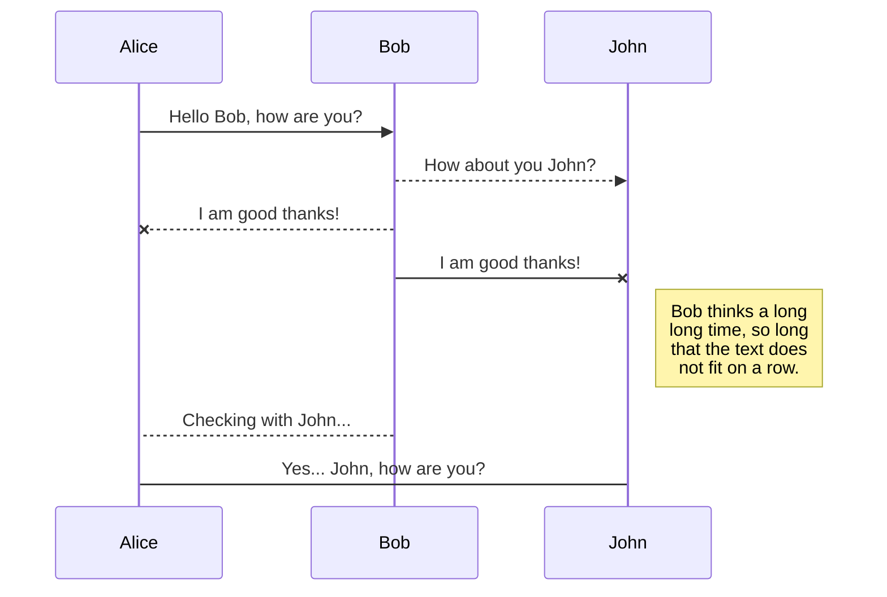

## Testing Microservices in Java

### Objective

The purpose of this repo is to serve as a reference when deciding what test levels to use to test a microservice.

### Test Examples

The following testing levels can be observed:

- [Unit Test | POJO | JUnit](tp-sut-uict/src/test/java/org/chicu/model/EmployeeDetailsBuilderTest.java)
- [Unit Test | Spring Beans | Mocking Dependencies | Mockito](tp-sut-uict/src/test/java/org/chicu/service/EmployeeServiceTest.java)
- [Integration Test | Rest Controller - HTTP | MockMvc](tp-sut-uict/src/test/java/org/chicu/controller/EmployeeControllerTest.java)
- [Integration Test | Persistence Layer - DB | JpaTest](tp-sut-uict/src/test/java/org/chicu/repository/EmployeeRepositoryTest.java)
- [Component Test | Service | Cucumber and RestAssured](tp-sut-uict/src/test/resources/features/rest/user-management.feature)
- [End-to-End Test | Service | Cucumber, RestAssured and Selenium](tp-sut-uict/src/test/resources/features/ui/user-management-ui.feature)

### SUT (System Under Test) as Docker Container

Steps to create the Docker image and run the container:
- `mvn clean package` - to package and create the jar file
- `docker build -t sample-sut4test .` - to build the Docker image
- `docker run -d -p 8081:8081 sample-sut4test` - to run the Docker container
- `http://localhost:8081/ui/v1/employees` - to check the application is running correctly 

### Workflow

